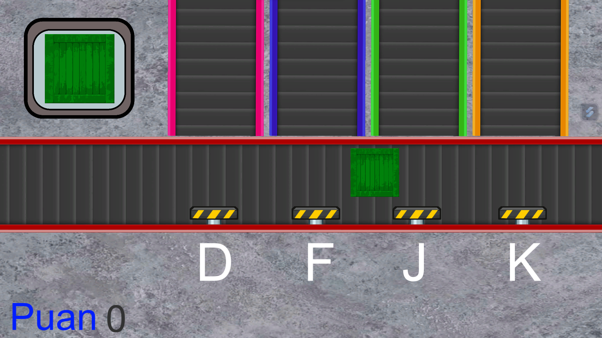
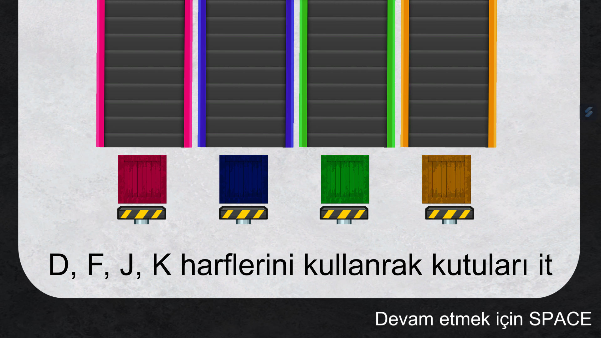

# Kargocu - Hızlı Oynanışlı Kargo Oyunu

**Kargocu**, 48 saat içinde geliştirilen bir Game Jam projesidir. Oyun, kargo şirketinde meydana gelen bir arıza sonucu paletlerin bozulmasıyla başlar. Oyuncuların amacı, bu bozulmuş paletlerden gelen kutuları doğru bantlara taşıyarak düzeni sağlamaktır. Hızlı refleksler ve zaman yönetimi oyunun temel unsurlarıdır.

Bu proje, Kıraathene Game Jam'de tema olarak "hızlı oynanış" seçildiğinde 3 kişilik bir ekip tarafından geliştirilmiştir.

## Özellikler

- Hızlı tempolu oynanış: Oyuncuların kutuları doğru bantlara yönlendirmek için hızlı reflekslere ihtiyacı vardır.
- Farklı zorluk seviyeleri: Oyun ilerledikçe, daha fazla kutu gelir ve bantlar daha hızlı döner, böylece zorluk artar.
- Eğlenceli grafikler: Renkli ve sevimli grafiklerle oyunun keyifli bir atmosferi vardır.
- Puan sistemi: Oyuncular başarılı taşımalardan puan kazanır ve yüksek skorları elde etmeye çalışırlar.

## Ekran Görüntüleri

